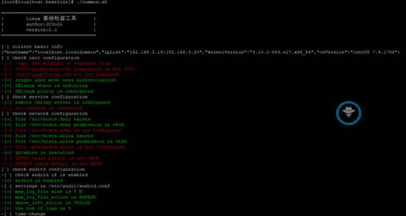
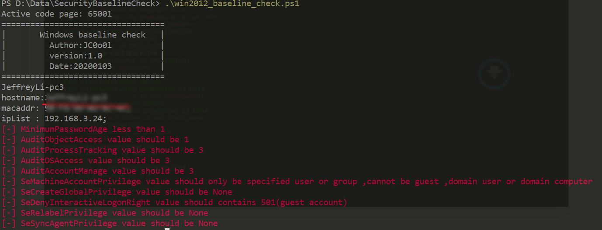

# SecurityBaselineCheck

## 0x01 介绍

这个项目准备打造一个安全基线检查平台，期望能够以最简单的方式在需要进行检查的服务器上运行。能够达到这么一种效果：基线检查脚本(以后称之为agent)可以单独在目标服务器上运行，并展示出相应不符合基线的地方，并且可以将检查时搜集到的信息以json串的形式上传到后端处理服务器上，后端服务器可以进行统计并进行可视化展示。

Agent用到的技术：

- Shell脚本
- Powershell脚本

后端服务器用到的技术：

- python
- django
- bootstrap
- html

存储所用：

- sqlite3

Linux Agent：

Windows Agent：

## 0x02 项目进展

- 20191215 根据CIS制定Centos7检查基线
- 20191228 发布LinuxAgent v1.0
  - 只能本地运行展示结果，无法上传JSON串
  - 只能对Centos7系统进行基线检查
- 20191230 更新LinuxAgent v2.0
  - 重构代码，增加上传JSON串功能
- 20191231 根据CIS制定Window2012检查基线
- 20200103 发布WindowsAgent v1.0
  - 只能在本地运行，无法上传JSON串