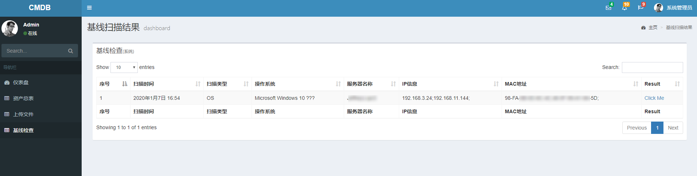
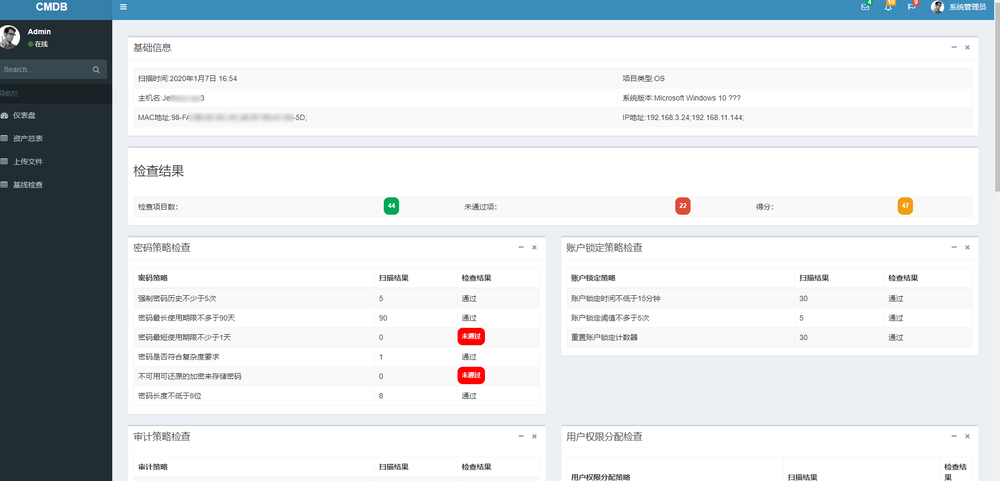
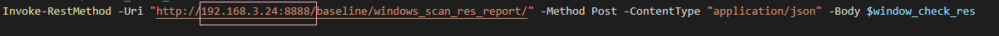
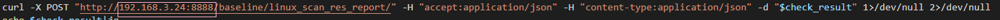

# SecurityBaselineCheck

## 0x01 介绍

这个项目准备打造一个安全基线检查平台，期望能够以最简单的方式在需要进行检查的服务器上运行。能够达到这么一种效果：基线检查脚本(以后称之为agent)可以单独在目标服务器上运行，并展示出相应不符合基线的地方，并且可以将检查时搜集到的信息以json串的形式上传到后端处理服务器上，后端服务器可以进行统计并进行可视化展示。

Agent用到的技术：

- Shell脚本
- Powershell脚本

后端服务器用到的技术：

- python
- django
- bootstrap
- html

存储所用：

- sqlite3

Linux Agent：


Windows Agent：


后端：

基线扫描记录：



基线扫描详情与检查结果：



## 0x02 项目进展

- 20191215 根据CIS制定Centos7检查基线
- 20191228 发布LinuxAgent v1.0
  - 只能本地运行展示结果，无法上传JSON串
  - 只能对Centos7系统进行基线检查
- 20191230 更新LinuxAgent v2.0
  - 重构代码，增加上传JSON串功能
- 20191231 根据CIS制定Window2012检查基线
- 20200103 发布WindowsAgent v1.0
  - 只能在本地运行，无法上传JSON串
- 20200105 发布WindowsAgent v2.0
  - 修改部分代码
  - 可以上传json串
- 20200108 更新AssetManage
  - 增加Windows基线检查图形展示界面
- 20200110 更新AssetManage，更新Linux基线检查脚本
  - 增加完善Linux基线检查图形展示界面
- 20200113 发布后端图形展示界面 
  - 后端展示界面源代码位于：`github.com/chroblert/assetmanage`
  - 后端展示界面docker镜像位于：

## 0x03 使用步骤

1\. 下载AssetManage这个后端展示项目,地址位于：[AssetManage](https://github.com/chroblert/AssetManage)

```shell
# 提前安装最新版SQLite3.30,python3.6
# git clone项目
git clone https://github.com/chroblert/assetmanage.git
cd AssetManage
# 使用python3安装依赖包
python3 -m pip install -r requirements
python3 manage.py makemigrations
python3 manage.py migrate
python3 manage.py runserver 0.0.0.0:8888
# 假定该服务器的IP未112.112.112.112
```

2\. 更改agent中后端服务器的ip和端口为上一步中服务器的IP`112.112.112.112`和端口`8888`

**对于Windows：**



**对于Linux：**



3\. 将Agent拖到要进行基线检查的服务器上，以管理员权限运行agent

4\. 访问后端服务器可视化展示界面：`http://112.112.112.112:8888`,

**点击基线检查，查看扫描记录**


**点击`Click Me`查看检查结果**


最后，希望大家多多关注下`信安札记`，给点支持@~@


---

参考资料：[在Django 2.2中启动开发服务器时处理SQLite3错误](https://cloud.tencent.com/developer/article/1439327)